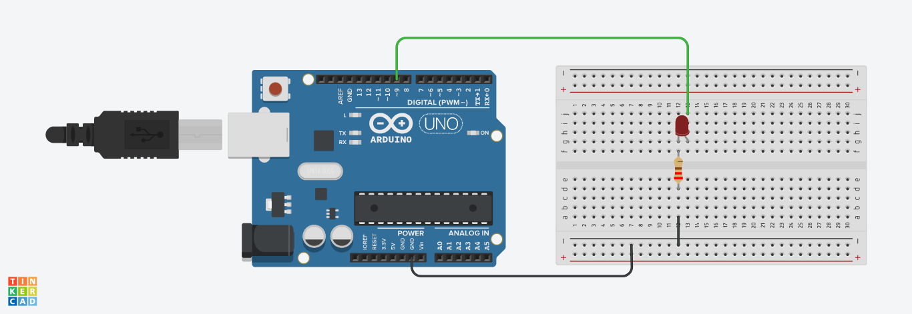
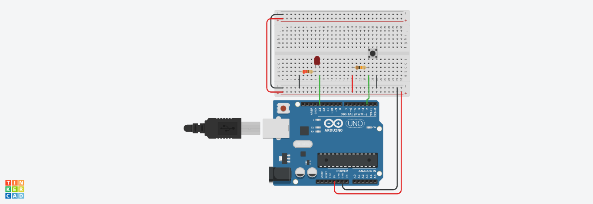
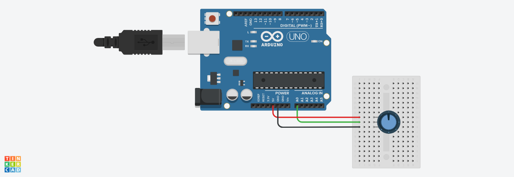
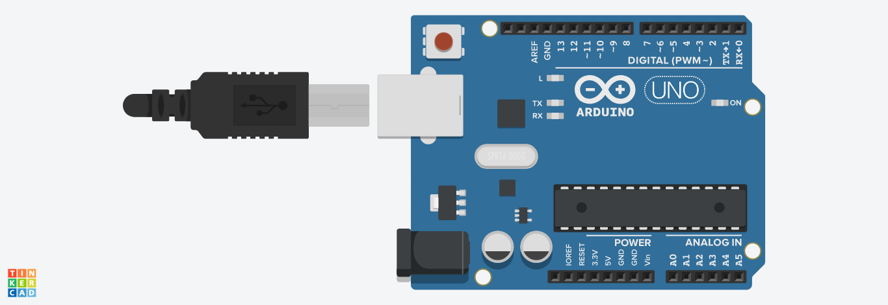
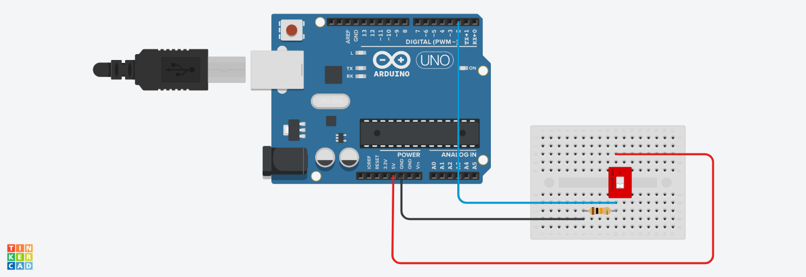
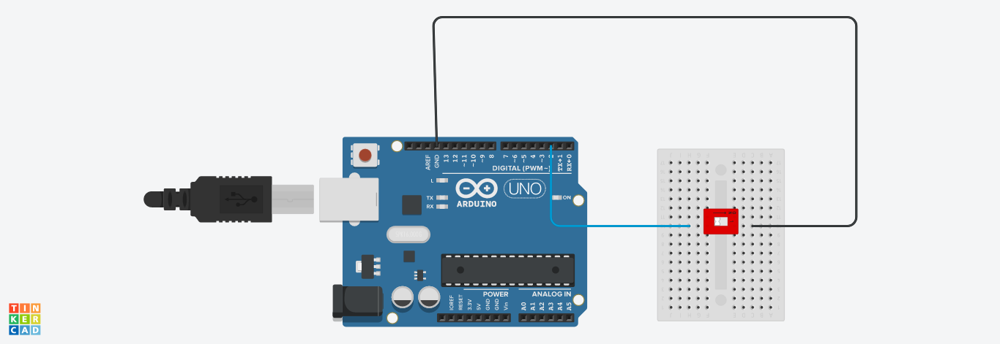

# Actividad de laboratorio 2

> ## Objetivos
> * Comprender los conceptos básicos para realizar prototipado
> * Adquirir la capacidad de comprender, codificar y adaptar programas que usen Arduino.
> * Familiarizarse con las diferentes herramientas de desarrollo de sistemas embebidos.

## Introducción

El prototipado es el primer paso para empezar esta historia...

## Material de apoyo

Para esta sesión, nos basaremos en el siguiente material disponible en la web:
* [What is arduino?](https://learn.sparkfun.com/tutorials/what-is-an-arduino/introduction)
* [Intro to Arduino - Zero to Prototyping in a Flash!](https://cdn.sparkfun.com/assets/3/9/d/9/e/Intro_to_Arduino_-_v30_1.pdf)

## Conceptos previos

Se recomienda tener claro los siguientes conceptos:
* [How to Use a Breadboard](https://learn.sparkfun.com/tutorials/how-to-use-a-breadboard)
* [How to Read a Schematic](https://learn.sparkfun.com/tutorials/how-to-read-a-schematic/
)
* [How to Read a Datasheet](https://www.sparkfun.com/tutorials/223?_ga=2.220939870.716925408.1637633025-812475524.1634861735)
 
## Guia

Tomando como base los ejemplos del documento **Intro to Arduino - Zero to Prototyping in a Flash!** realizar las siguientes actividades:

La siguiente imagen muestra la placa de desarrollo arduino uno:


Ademas, se recomienda que tenga a la mano el resumén [Arduino Programming Cheat Sheet](https://github.com/UdeA-IoT/reference-sheets/blob/main/percepcion/arduino/Arduino_Programming_Cheat_Sheet.pdf). Este contiene, las funciones mas comunes a usar con arduino y será el primer elemento de consulta cuando se este analizando código. En caso de que necesite profundizar mas, se recomienda acceder a la documentación la cual se encuentra en el siguiente
([link](https://docs.arduino.cc/hardware/uno-rev3)) 

En los siguientes ejemplos se va a mostrar como hacer uso de los puertos de entrada y salida basicos del arduino para conectar entradas y salidas analogas y digitales. 

### Ejemplo 1 

Hacer un programa que haga que un led titile cada segundo. 

* **Programa**

```arduino
void setup()
{
  pinMode(LED_BUILTIN, OUTPUT);
}

void loop()
{
  digitalWrite(LED_BUILTIN, HIGH);
  delay(1000); // Wait for 1000 millisecond(s)
  digitalWrite(LED_BUILTIN, LOW);
  delay(1000); // Wait for 1000 millisecond(s)
}
```

* **Diagrama de conexión**


* **Simulación**: [link](https://www.tinkercad.com/things/0t8K1gwnRN4)

* **Conclusión**: En el ejemplo anterior vimos como confirar un puerto como salida, como asignarle un valor de voltaje y como usar funciones de tiempo.

**Retos**:
1. Hacer un programa que permita que un led permanezca prendido durante 200 ms de un total de 1 segundo.
2. Hacer un programa que imite el latido del corazón (heartbeat).
3. Hacer un programa que use una secuencia de 8 leds de tal manera que estos brillen como el auto fantastico.
   
### Ejemplo 2 

Existen unos pines del arduino que permiten modificar la salida para imitar una señal analoga. Esto se hace por medio de una tecnica conocida como [PWM](https://learn.sparkfun.com/tutorials/pulse-width-modulation/all).

La tecnica PWM es muy empleada para modificar el brillo de leds y cambiar la velocidad de un motor entre otras.

* **Enunciado**

Hacer un programa que permita cambiar el brillo de un led (Codigo tomado de: https://www.arduino.cc/en/Tutorial/BuiltInExamples/Fade)

* **Programa**

```arduino

int led = 9;           // the PWM pin the LED is attached to
int brightness = 0;    // how bright the LED is
int fadeAmount = 5;    // how many points to fade the LED by

// the setup routine runs once when you press reset:
void setup() {
  // declare pin 9 to be an output:
  pinMode(led, OUTPUT);
}

// the loop routine runs over and over again forever:
void loop() {
  // set the brightness of pin 9:
  analogWrite(led, brightness);

  // change the brightness for next time through the loop:
  brightness = brightness + fadeAmount;

  // reverse the direction of the fading at the ends of the fade:
  if (brightness <= 0 || brightness >= 255) {
    fadeAmount = -fadeAmount;
  }
  // wait for 30 milliseconds to see the dimming effect
  delay(30);
}
```

* **Diagrama de conexión**
  


* **Simulación**: [link](https://www.tinkercad.com/things/jaQpxHxVLwI)


* **Conclusión**: En este ejemplo vimos como usar la función ```analogWrite``` para cambiar el porcentaje de dureza de una señal PWM.

**Retos**:
1. Hacer un programa que use dos o mas leds de manera que el brillo de estos vaya cambiando secuencialmente es decir; que se vea un efecto tal que, que mientras el primero va dejando de brillar el siguiente a este empieze a brillar y asi sucesivamente.

### Ejemplo 3

Existen leds ([link](https://learn.sparkfun.com/tutorials/light-emitting-diodes-leds?_ga=2.226108892.716925408.1637633025-812475524.1634861735#types-of-leds)) que permiten alumbrar generando diferentes en diferentes tonalidades, estos led se conocen como leds RGB ([link](https://www.sparkfun.com/products/105)). El cambio de color de estos leds se controla alimentando con un voltaje analogo las terminales asociadas a los colores primarios para generar el color resultante de la combinación de estos. Con el fin de modificar el voltaje analogo, se hace uso de una señal PWM. 


* **Enunciado**:
El siguiente programa conecta un led rgb de la siguiente manera:

|Pin Led RGB|Pin arduino|
|--|--|
|Red| 5|
|Green| 6|
|Blue| 9 |
|Catodo| GND|

Luego, modifique el color del led empleando el siguiente selector de color RGB ([link](https://www.webfx.com/web-design/color-picker/)).

* **Programa**

```arduino
int redPin = 5;
int greenPin = 6;
int bluePin = 9;

void setup() {
  pinMode(redPin, OUTPUT);
  pinMode(greenPin, OUTPUT);
  pinMode(bluePin, OUTPUT);
}

void loop() {
  analogWrite(redPin, 12);
  analogWrite (greenPin, 255);
  analogWrite (bluePin, 100);
}
```

* **Diagrama de conexión**
  


* **Simulación**: [link](https://www.tinkercad.com/things/fr6TOjwNaOO)

* **Conclusión**: Acavamos de ver otro ejemplo de una aplicación donde se usa el PWM.

### Ejemplo 4a

Una **entrada** es cualquier señal electrica que entra a un sistema electrino. Cualquier tipo de sensor tanto analogo como digital son formas de entrada. Tambien, existen otras formas de entrada como: teclados, mouses, sensores infrarrojos, sensores biometricos entre otros.

* **Enunciado**: Hacer un programa que apague el led de la placa arduino cuando se presione un push button. Para mas información sobre los tipos de botones puede acceder al siguiente [link](https://www.sparkfun.com/news/3543).

* **Programa**

```arduino
const int buttonPin = 2;     // the number of the pushbutton pin
const int ledPin =  13;      // the number of the LED pin

// variables will change:
int buttonState = 0;         // variable for reading the pushbutton status

void setup() {
  // initialize the LED pin as an output:
  pinMode(ledPin, OUTPUT);
  // initialize the pushbutton pin as an input:
  pinMode(buttonPin, INPUT);
}

void loop() {
  // read the state of the pushbutton value:
  buttonState = digitalRead(buttonPin);

  // check if the pushbutton is pressed. If it is, the buttonState is HIGH:
  if (buttonState == HIGH) {
    // turn LED on:
    digitalWrite(ledPin, HIGH);
  } else {
    // turn LED off:
    digitalWrite(ledPin, LOW);
  }
}
```

* **Diagrama de conexión**
  


* **Simulación**: [link](https://www.tinkercad.com/things/6MG0jFvAYl1)

## Ejemplo 4b

* **Enunciado**: Use el mismo programa anterior pero en este caso conecte un led al puerto 13 del arduino.

* **Programa**

```arduino
// constants won't change. They're used here to set pin numbers:
const int buttonPin = 2;     // the number of the pushbutton pin
const int ledPin =  13;      // the number of the LED pin

// variables will change:
int buttonState = 0;         // variable for reading the pushbutton status

void setup() {
  // initialize the LED pin as an output:
  pinMode(ledPin, OUTPUT);
  // initialize the pushbutton pin as an input:
  pinMode(buttonPin, INPUT);
}

void loop() {
  // read the state of the pushbutton value:
  buttonState = digitalRead(buttonPin);

  // check if the pushbutton is pressed. If it is, the buttonState is HIGH:
  if (buttonState == HIGH) {
    // turn LED on:
    digitalWrite(ledPin, HIGH);
  } else {
    // turn LED off:
    digitalWrite(ledPin, LOW);
  }
}
``` 

* **Diagrama de conexión**
  


* **Simulación**: [link](https://www.tinkercad.com/things/6Amfkas3Ydh)

### Ejemplo 5

* **Enunciado**: Hacer un programa que permita imprimir serialmente el voltaje de entrada analogo a traves de la entrada **A0**. En este caso se usa un potenciometro, para mas información puede consultar el siguiente [link](https://learn.sparkfun.com/tutorials/sparkfun-inventors-kit-experiment-guide---v40/circuit-1b-potentiometer)


* **Programa**

```arduino
void setup() {
  // initialize serial communication at 9600 bits per second:
  Serial.begin(9600);
}

// the loop routine runs over and over again forever:
void loop() {
  // read the input on analog pin 0:
  int sensorValue = analogRead(A0);
  // Convert the analog reading (which goes from 0 - 1023) to a voltage (0 - 5V):
  float voltage = sensorValue * (5.0 / 1023.0);
  // print out the value you read:
  Serial.println(voltage);
}
```

* **Diagrama de conexión**
  


* **Simulación**: [link](https://www.tinkercad.com/things/27wXqHT0oTA)

### Ejemplo 6

Un metodo de comunicación ampliamente usado para transferir datos entre dos dispositivos es el serial ([link](https://learn.sparkfun.com/tutorials/serial-communication/all)).

* **Enunciado**: Hacer un programa que permita enviar desde el arduino al monitor serial de la computadora el mensaje: ```Hands on Learning is Fun!!!```

* **Programa**

```arduino
// the setup routine runs once when you press reset:
void setup() {
  // initialize serial communication at 9600 bits per second:
  Serial.begin(9600);
}

// the loop routine runs over and over again forever:
void loop() {
  Serial.print("Hands on ") ;
  Serial.print("Learning ") ;
  Serial.println("is Fun!!!") ;
  delay(1000);
}
```

* **Diagrama de conexión**
  


* **Simulación**: [link](https://www.tinkercad.com/things/gYIx1iiQj7x)

### Ejemplo 7a

Hacer un programa que muestre serialmente el valor de una entrada digital conectada a un switch.

* **Programa**

```arduino
// digital pin 2 has a pushbutton attached to it. Give it a name:
int button = 2;

// the setup routine runs once when you press reset:
void setup() {
  // initialize serial communication at 9600 bits per second:
  Serial.begin(9600);
  // make the pushbutton's pin an input:
  pinMode(button, INPUT);
}

// the loop routine runs over and over again forever:
void loop() {
  // read the input pin:
  int buttonState = digitalRead(button);
  // print out the state of the button:
  Serial.print("Pin 2: ");
  Serial.println(buttonState);
  delay(1);        // delay in between reads for stability
}
```

* **Diagrama de conexión**
  



* **Simulación**: [link](https://www.tinkercad.com/things/bl8JS2MrvKW)

### Ejemplo 7b

* **Enunciado**: Hacer un programa que muestre serialmente el valor de una entrada digital conectada a un switch. Para este caso haga uso de la resistencia de pull-up interna del arduino.

* **Programa**

```arduino
// digital pin 2 has a pushbutton attached to it. Give it a name:
int button = 2;

// the setup routine runs once when you press reset:
void setup() {
  // initialize serial communication at 9600 bits per second:
  Serial.begin(9600);
  // make the pushbutton's pin an input:
  pinMode(button, INPUT_PULLUP);
}

// the loop routine runs over and over again forever:
void loop() {
  // read the input pin:
  int buttonState = digitalRead(button);
  // print out the state of the button:
  Serial.print("Pin 2: ");
  Serial.println(buttonState);
  delay(1);        // delay in between reads for stability
}
```

* **Diagrama de conexión**
  


* **Simulación**: [link](https://www.tinkercad.com/things/69EL3QVYUwN)
  
## Actividad de programación

Hacer un programa que permita escribir un mensaje en clave morse empleando un led. Como punto de partira, puede usar el siguiente [ejemplo](https://create.arduino.cc/projecthub/stannano/use-morse-code-on-an-led-91a7a9).

La tabla del código morse se muestra a continuación:


## Pendiente

Ver: https://github.com/simonmonk/programming_arduino_ed2

## Enlaces
* https://learn.sparkfun.com/tutorials/sik-experiment-guide-for-arduino---v32/all#experiment-13-using-relays
* https://create.arduino.cc/projecthub/stannano/use-morse-code-on-an-led-91a7a9
* https://github.com/leeassam/arduino-bootcamp
* https://github.com/herculanodavi/arduino_udemy/tree/master/Documentation
* https://github.com/simonmonk/programming_arduino_ed2
* https://github.com/jithinsisaac/KiCad-Arduino-Clone
* https://github.com/tomasdecamino/CursoArduinoIntermedio
* https://gist.github.com/bankhonggioidotcom/27a33d23db2594e32e8d73096170f652
* https://github.com/mikeroyal/Arduino-Guide
* https://github.com/simonmonk/arduino_course_es

